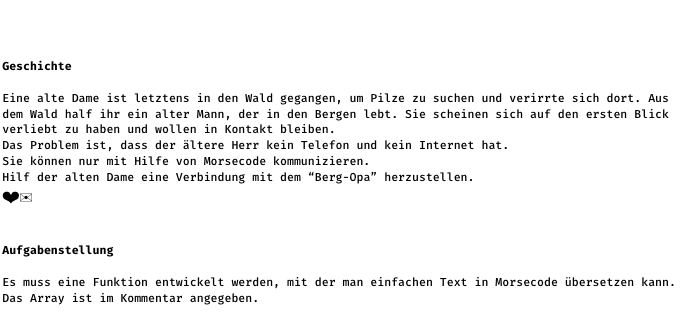
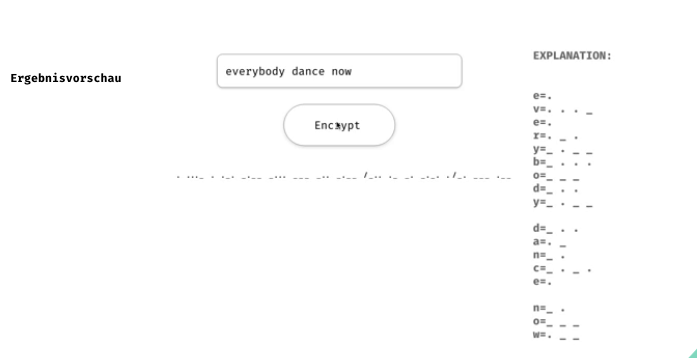

Projekt lev3_5: Morse Code

Eine Übung im SuperCode Bootcamp

## 🎓 Aufgabe

Es muss eine Funktion entwickelt werden, mit der man einfachen Text in Morsecode übersetzen kann. Das Array ist im Kommentar angegeben.

## 📸 Screenshots

## 💻 Running

Zur Seite —> - [Lev3_6_Project_css-vertiefung_the-design-shop](https://mukkez.github.io/Bootcamp/tasks/Day_39/Lev3_6_Project_css-vertiefung_the-design-shop/)

<h3 align="left">Languages and Tools:</h3>

 
 
 

